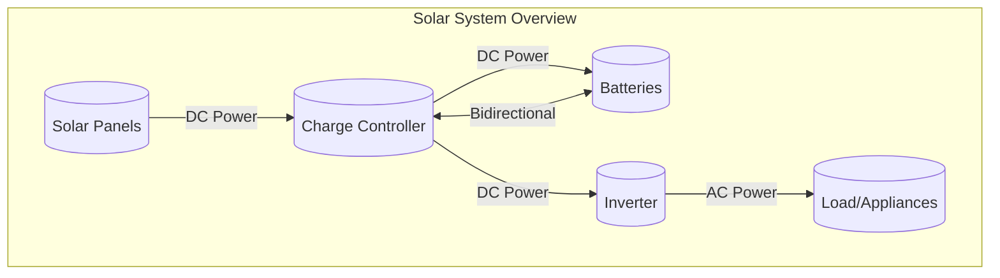

```mermaid

flowchart LR
    subgraph "Solar System Overview"
        direction LR
        A[("Solar Panels")] -->|"DC Power"| B[("Charge Controller")]
        B -->|"DC Power"| C[("Batteries")]
        B -->|"DC Power"| D[("Inverter")]
        D -->|"AC Power"| E[("Load/Appliances")]
        
        C <-->|"Bidirectional"| B
    end
```
